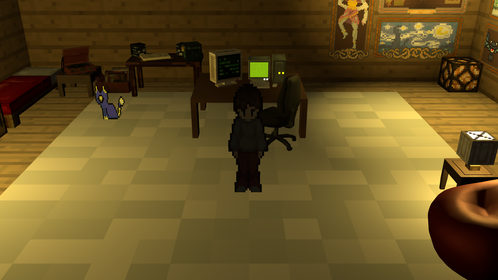
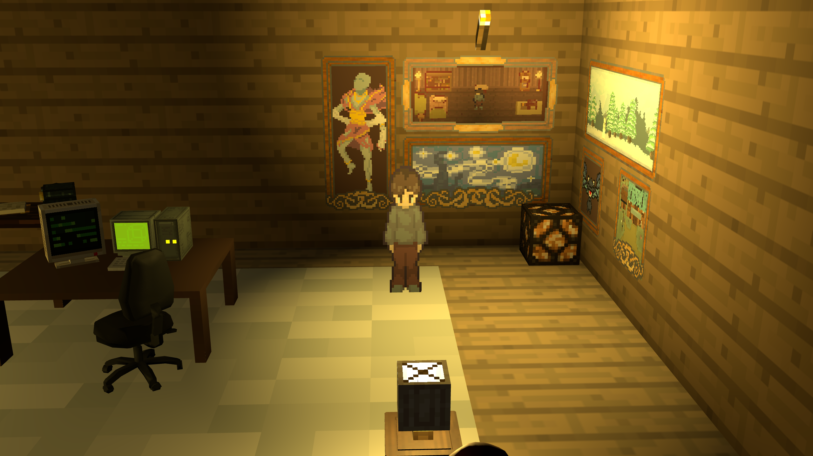
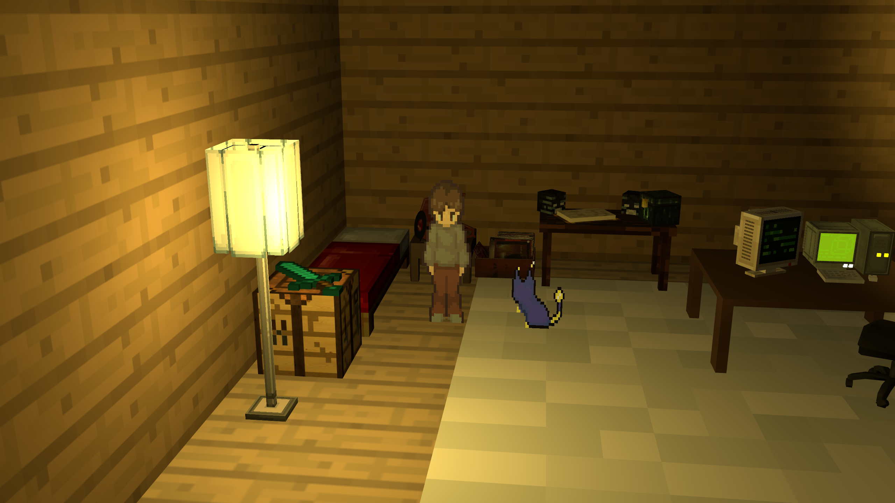
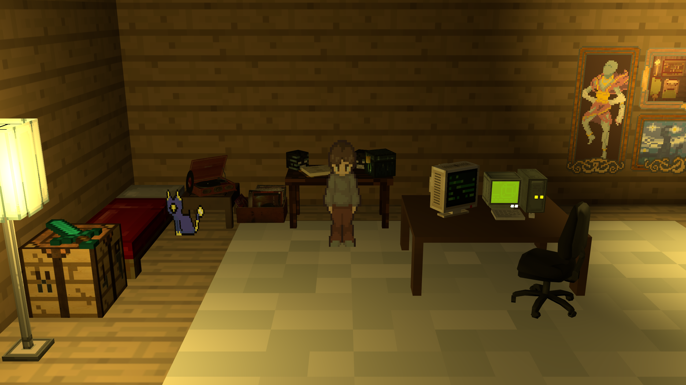

# 🎮 VarunChaaras - Interactive 3D Portfolio

A unique, immersive 3D portfolio experience built with Three.js that lets visitors explore my work in a virtual environment. Navigate through a cozy room filled with interactive elements, pixel art aesthetics, and spatial audio - all running smoothly on both desktop and mobile devices.

[](https://varunchaaras.art)

## ✨ Features

### 🎨 Immersive 3D Environment
- **Fully navigable 3D space** with a custom-designed room featuring pixel-perfect models
- **Dynamic lighting system** with multiple point lights creating ambient atmosphere
- **Pixel art aesthetic** with crisp, nearest-neighbor filtering for that retro charm

### 🎵 Spatial Audio Experience
- **3D positional audio** that gets louder as you approach the record player
- **Lo-fi radio effect** with custom audio filters for authentic vintage sound
- **Interactive music controls** - walk up to the record player and press 'E' to play/pause

### 🖼️ Interactive Art Gallery
- **Clickable paintings** showcasing projects and artwork
- **Full-screen modal viewer** for detailed project inspection
- **Curated collection** of personal projects and creative work

### 🔗 Quick Access Links
- **Resume integration** - interact with the research table to view credentials
- **GitHub profile** - check out the computer desk to explore repositories
- **Smooth transitions** with intuitive interaction prompts

### 📱 Mobile-First Design
- **Touch-optimized controls** with dynamic virtual joystick
- **Responsive joystick** that appears where you touch
- **Tap-to-interact** system for mobile-friendly navigation
- **Optimized performance** with adaptive pixel ratios

### 🎬 Animated Characters
- **Animated player sprite** with smooth 4x10 frame animation
- **Delta time implementation** for consistent frame-rate independent animations
- **LumiCat companion** - an adorable animated cat that wanders the room

### 🎯 Smart Menu System
- **Animated start screen** with 10-frame sprite sheet background
- **Three navigation options**: Start Game, Resume, Settings
- **Hover effects** and smooth transitions
- **Loading screen** with elegant fade-in

## 🎮 Controls

### Desktop
- **W A S D** or **Arrow Keys** - Move around
- **E** - Interact with objects (record player, tables, paintings)
- **F** - Toggle fullscreen
- **Click** on paintings to view in detail

### Mobile
- **Virtual Joystick** - Appears where you touch to move
- **Tap** - Interact with highlighted objects
- **Pinch/Tap** paintings to view full-screen

## 🖼️ Screenshots

### Main Environment

*The main room with ambient lighting and interactive objects*

### Interactive Elements

*Get close to objects to see interaction prompts*

### Art Gallery

*Explore the walls featuring project showcases*

### Menu System

*Animated start menu with pixel art background*

## 🛠️ Tech Stack

- **Three.js** - 3D rendering engine
- **Vite** - Fast build tool and dev server
- **Vanilla JavaScript** - Pure ES6+ modules
- **Web Audio API** - Spatial audio and filters
- **GLSL** - Custom shaders for pixel-perfect rendering

## 🚀 Getting Started

### Prerequisites
- Node.js (v14 or higher)
- npm or yarn

### Installation

```bash
# Clone the repository
git clone https://github.com/slugoguls/VarunChaaras.git

# Navigate to project directory
cd VarunChaaras

# Install dependencies
npm install

# Start development server
npm run dev
```

The site will be available at `http://localhost:5173`

### Building for Production

```bash
# Create optimized production build
npm run build

# Preview production build locally
npm run preview
```

## 📁 Project Structure

```
VarunChaaras/
├── src/
│   ├── index.html          # Main HTML entry
│   ├── script.js           # Main application logic
│   ├── style.css           # Global styles
│   ├── camera.js           # Camera controller
│   ├── player.js           # Player character logic
│   ├── lumiCat.js          # Animated cat companion
│   ├── menu.js             # Menu screen system
│   ├── joystick.js         # Mobile virtual joystick
│   ├── room.js             # 3D room generation
│   ├── objectLoader.js     # GLB model loader
│   ├── paintingLoader.js   # Gallery system
│   ├── spriteLoader.js     # Sprite sheet handler
│   └── uiElements.js       # UI interaction prompts
├── assets/
│   ├── Models/             # 3D GLB models
│   ├── paintings/          # Project artwork
│   ├── sounds/             # Audio files
│   ├── textures/           # Wall and floor textures
│   ├── Menu/               # Menu assets
│   └── Char/               # Character sprites
└── vite.config.js          # Vite configuration
```

## 🎯 Key Features Breakdown

### Delta Time Animation System
Frame-rate independent animations ensure smooth performance across all devices:
- Player animation: 0.15s per frame
- Movement speed: 3.5 units/second
- Cat animation: 0.15s frame duration with 1.0 speed multiplier

### 2D Distance Calculations
Smart collision and interaction detection using 2D distance (ignoring Y-axis) for floor-based interactions, ensuring consistent behavior regardless of camera angle.

### Audio Spatial Configuration
- **Linear distance model** for predictable audio falloff
- **Rolloff factor**: 1 for natural sound decay
- **Reference distance**: 5 units (100% volume)
- **Max distance**: 25 units (audio range)

### Mobile Optimizations
- Conditional pixel ratio (1x for mobile, up to 2x for desktop)
- Dynamic joystick with 150px container and 60px max distance
- Touch event handling with passive listeners
- Viewport meta tags for proper mobile scaling

## 🎨 Design Philosophy

This portfolio breaks away from traditional 2D websites by creating an **experiential narrative**. Visitors don't just read about projects - they explore, discover, and interact. The pixel art aesthetic pays homage to classic games while the modern Three.js implementation ensures smooth, responsive performance.

Every element serves a purpose:
- The **record player** represents my love for music and ambient design
- The **research table** showcases academic and professional achievements  
- The **computer desk** links to my active development work
- The **paintings** tell visual stories of completed projects
- The **companion cat** adds personality and life to the space

## 🔧 Configuration

### Vite Config Highlights
- **Root directory**: `src/`
- **Public directory**: `assets/`
- **Build target**: `esnext` (supports top-level await)
- **Network exposure**: Enabled for mobile testing

## 📝 License

This project is open source and available under the [MIT License](LICENSE).

## 🤝 Connect

- **GitHub**: [@slugoguls](https://github.com/slugoguls)
- **Portfolio**: [Live Demo](https://varun-chaaras.vercel.app)
- **Resume**: Available via the research table in the portfolio

## 🙏 Acknowledgments

- Three.js community for excellent documentation
- Pixel art inspiration from classic games
- Lo-fi music community for audio aesthetic guidance

---

**Built with ❤️ by Varun** | **Deployed on Vercel** ⚡
